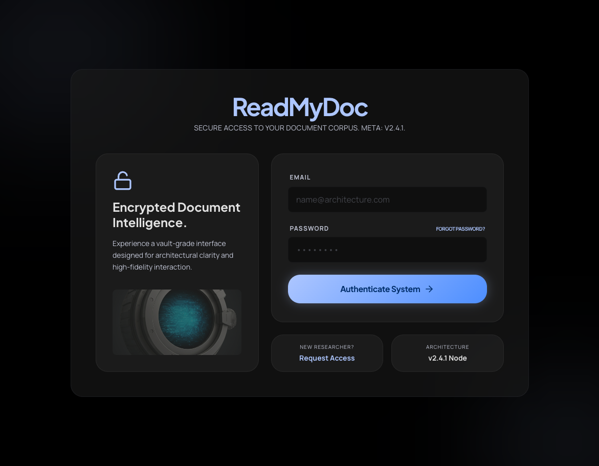
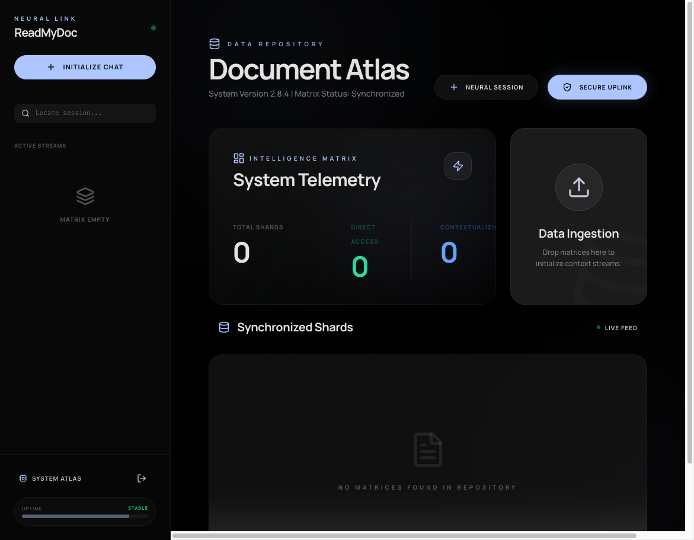
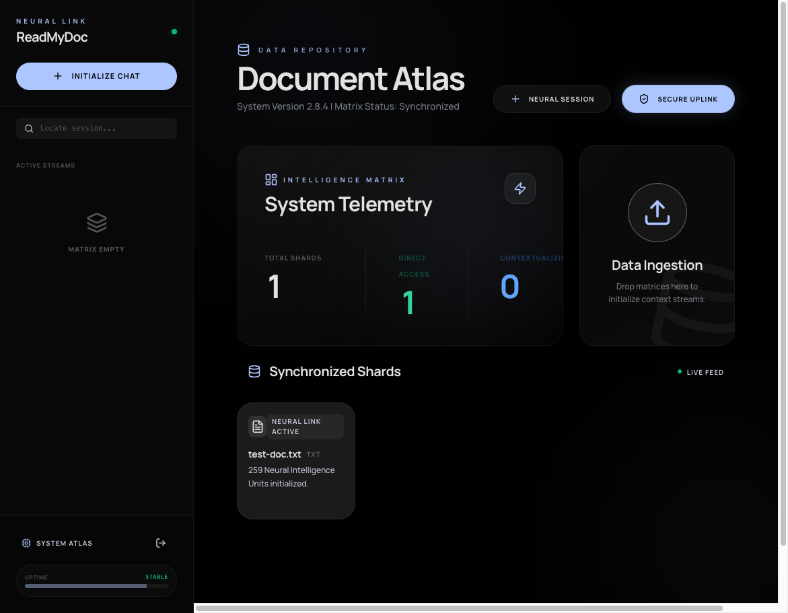
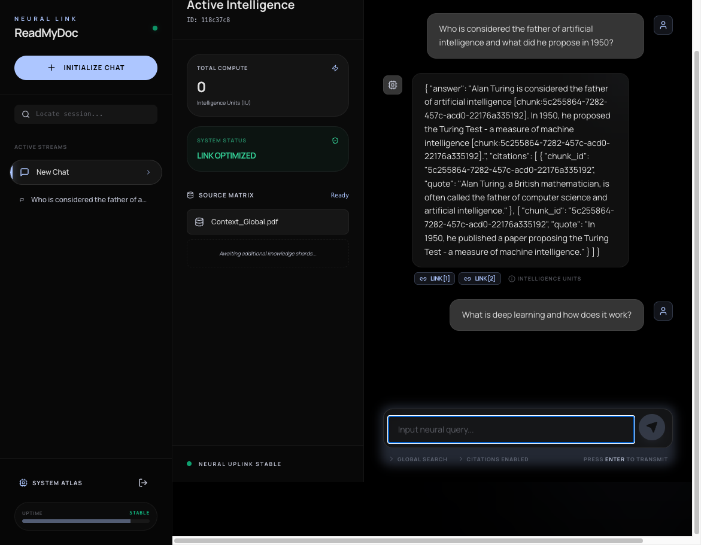

# Ask My Docs

> Upload your documents. Ask questions. Get cited answers.

[](https://github.com/Mystery01092000/read-my-doc/actions/workflows/ci.yml)
[](LICENSE)
[](https://www.python.org/downloads/)
[](docker-compose.yml)
[](https://github.com/Mystery01092000/read-my-doc/blob/main/.github/CONTRIBUTING.md)

A full-stack, self-hosted document Q&A platform. Upload PDFs, Markdown, Excel, or PowerPoint files, then chat with them using natural language and receive answers with verified inline citations.

## Screenshots

| Login | Documents | Upload | Chat with Citations |
|-------|-----------|--------|---------------------|
|  |  |  |  |

## Features

- **Multi-format upload** — PDF, TXT, Markdown, CSV, Excel, PowerPoint (up to 50 MB)
- **Hybrid retrieval** — BM25 (PostgreSQL tsvector) + vector search (pgvector) fused with Reciprocal Rank Fusion
- **Cross-encoder reranking** — top-20 candidates reranked with `ms-marco-MiniLM-L-6-v2`
- **Citation enforcement** — every answer includes verified inline citations with page/section references
- **Session history** — all conversations saved; revisit any session from the sidebar
- **CI-gated evaluation** — RAGAS faithfulness ≥ 0.8 and citation accuracy ≥ 0.9 enforced on PRs
- **Self-hosted** — runs entirely with `docker compose up`; Ollama for LLM, no external APIs required
- **Cloud-ready** — swap to Groq (free tier) for serverless deployment on Vercel + Render + Supabase

## Quick Start

### Prerequisites

- [Docker](https://docs.docker.com/get-docker/) 24+ and Docker Compose v2
- 8 GB RAM (for Ollama LLM)
- `make`

```bash
# 1. Clone and copy env
git clone https://github.com/Mystery01092000/read-my-doc.git && cd read-my-doc
cp .env.example .env
# Edit .env — set JWT_SECRET_KEY to a long random secret

# 2. Start all services
make dev

# 3. Pull an LLM model (in a separate terminal)
make pull-model

# 4. Run database migrations
make migrate
```

Frontend: http://localhost:3000  
API docs: http://localhost:8000/docs  
Celery Flower: http://localhost:5555

## Architecture

```
Browser (React 18 + Vite + TypeScript)
    │
    ▼
FastAPI (Python 3.12) — REST API + SSE streaming
    ├── Auth     — JWT access/refresh tokens, bcrypt passwords
    ├── Documents — upload → Celery → parse → chunk → embed → pgvector
    └── Chat     — hybrid retrieve → cross-encoder rerank → Ollama/Groq → cited answer
    │
    ▼
PostgreSQL 16 + pgvector   Redis 7   Ollama (or Groq)
```

### RAG Query Flow

```
Question → embed → [pgvector cosine + tsvector BM25] → RRF merge → cross-encoder rerank → LLM → cited answer
```

## Tech Stack

| Layer | Technology |
|-------|-----------|
| Frontend | React 18, Vite, TypeScript, Tailwind CSS |
| Backend | Python 3.12, FastAPI, SQLAlchemy async |
| Database | PostgreSQL 16 + pgvector extension |
| BM25 | PostgreSQL tsvector + GIN index |
| Embeddings | BAAI/bge-small-en-v1.5 (sentence-transformers) |
| Reranker | cross-encoder/ms-marco-MiniLM-L-6-v2 |
| LLM | Ollama (self-hosted) · Groq · OpenAI (configurable) |
| Task Queue | Celery + Redis |
| Migrations | Alembic |
| State | Zustand |

## Development

```bash
make test         # Run tests (excluding eval)
make test-cov     # Tests with HTML coverage report
make eval         # Run RAG evaluation suite
make lint         # Ruff + TypeScript checks
make format       # Auto-format backend code
make migrate-new MSG="add index"   # New Alembic migration
```

## Environment Variables

| Variable | Default | Description |
|----------|---------|-------------|
| `DATABASE_URL` | `postgresql+asyncpg://...` | PostgreSQL connection string |
| `REDIS_URL` | `redis://localhost:6379/0` | Redis connection string |
| `JWT_SECRET_KEY` | *(required)* | Secret for JWT signing |
| `LLM_PROVIDER` | `ollama` | `ollama` · `openai` · `groq` |
| `OLLAMA_BASE_URL` | `http://localhost:11434` | Ollama API base URL |
| `LLM_MODEL` | `mistral` | Ollama model name |
| `GROQ_API_KEY` | *(optional)* | Required if `LLM_PROVIDER=groq` |
| `GROQ_MODEL` | `llama3-70b-8192` | Groq model name |
| `OPENAI_API_KEY` | *(optional)* | Required if `LLM_PROVIDER=openai` |
| `EMBEDDING_MODEL` | `BAAI/bge-small-en-v1.5` | Sentence-transformers model |
| `RERANKER_MODEL` | `cross-encoder/ms-marco-MiniLM-L-6-v2` | Cross-encoder model |
| `MAX_UPLOAD_SIZE_MB` | `50` | Maximum file upload size |
| `UPLOAD_DIR` | `/data/uploads` | File storage directory |

See [`.env.example`](.env.example) for the full list with descriptions.

## Cloud Deployment (Free Tier)

Deploy without a local GPU using Vercel + Render + Supabase + Upstash + Groq — all free tiers.

See **[docs/deployment/CLOUD.md](docs/deployment/CLOUD.md)** for the step-by-step guide.

| Service | Provider | Free Tier |
|---------|----------|-----------|
| Frontend | Vercel | 100 GB bandwidth/mo |
| Database + pgvector | Supabase | 500 MB |
| Redis | Upstash | 10K req/day |
| Backend + Workers | Render | 750 hrs/mo |
| LLM | Groq | Rate-limited free tier |

## Project Structure

```
read-my-doc/
├── backend/
│   ├── app/
│   │   ├── auth/          # JWT auth (register, login, refresh, logout)
│   │   ├── documents/     # Upload, parse, chunk, embed pipeline
│   │   ├── chat/          # Sessions, messages, SSE streaming
│   │   ├── rag/           # Embedder, retriever, reranker, generator
│   │   └── common/        # DB, security, exceptions, pagination
│   ├── tasks/             # Celery workers (document processing)
│   ├── alembic/           # Database migrations
│   └── tests/
│       ├── auth/
│       ├── documents/
│       ├── chat/
│       ├── rag/
│       └── eval/          # RAG evaluation suite + golden fixtures
├── frontend/
│   └── src/
│       ├── features/      # auth, documents, chat, history
│       ├── api/           # typed API clients
│       ├── store/         # zustand auth store
│       └── hooks/
├── docs/
│   ├── screenshots/       # UI screenshots for README
│   └── deployment/        # Cloud deployment guide
└── docker-compose.yml
```

## Evaluation Pipeline

The CI pipeline runs `make eval` on every PR that touches `backend/app/rag/**`:

| Metric | Threshold | Description |
|--------|-----------|-------------|
| Citation Accuracy | ≥ 0.90 | % of citations referencing valid retrieved chunks |
| Faithfulness | ≥ 0.80 | Answers grounded in retrieved context |

Tests in `backend/tests/eval/` run without requiring a live LLM — citation accuracy is validated through the post-processing logic directly, and faithfulness uses a heuristic token-overlap scorer.

## Roadmap

- [ ] **Multi-user document spaces** — shared workspaces with role-based access
- [ ] **Streaming citations** — show citation chips inline as the answer streams
- [ ] **Re-upload / versioning** — replace a document and preserve chat history
- [ ] **OpenAI embeddings option** — swap sentence-transformers for text-embedding-3-small

## Contributing

Contributions are welcome! Please read [CONTRIBUTING.md](.github/CONTRIBUTING.md) before opening a PR.

## License

MIT — see [LICENSE](LICENSE) for details.
